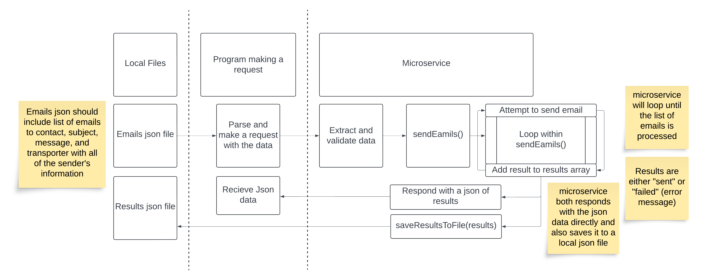

# Microservice Documentation

## Programmatically Requesting Data

To send a request to the microservice, follow these steps:

### Endpoint

- **URL**: `http://localhost:3000/send-emails`
- **Method**: `POST`

### Request Body

You need to send a JSON object with the following structure. This JSON will be used by the microservice to send emails:

- **emails**: An array of recipient email addresses.
- **subject**: The subject of the email.
- **message**: The content of the email.
- **transporter**: Configuration for the email transporter, including server details and authentication credentials.

### Example Request

To send a POST request to the microservice, use the following JSON structure:

```json
{
    "emails": ["email1@example.com", "email2@example.com"],
    "subject": "Test Subject",
    "message": "This is a test message",
    "transporter": {
        "host": "smtp.ethereal.email",
        "port": 587,
        "secure": false,
        "auth": {
            "user": "username@ethereal.com",
            "pass": "user_password"
        }
    }
}
```

You can send this request using tools like curl, Postman, or a similar HTTP client. Here’s an example using curl:
```
curl -X POST http://localhost:3000/send-emails \
     -H "Content-Type: application/json" \
     -d '{provided json structure}'
```

## Programmatically Receiving Data

The microservice responds with the results of the email sending operation. You will receive a JSON object indicating the status of each email sent.

### Response Body

- **results:** An array of result objects, each containing:
  - **email:** The recipient’s email address.
  - **status:** The status of the email (e.g., "sent" or "failed").
  - **error (optional):** An error message if the email failed to send.

#### Example Response

```json
{
  "results": [
    {
      "email": "email1@example.com",
      "status": "sent"
    },
    {
      "email": "email2@example.com",
      "status": "failed",
      "error": "error message"
    }
  ]
}
```

## Example Microservice Call

Using `axios` in a Node.js script:

```javascript
const axios = require('axios');

const sendRequest = async () => {
    try {
        const response = await axios.post('http://localhost:3000/send-emails', {
            // your request data
        });
        console.log('Response:', response.data);
    } catch (error) {
        console.error('Error:', error.response ? error.response.data : error.message);
    }
};

sendRequest();
```

## UML Diagram


